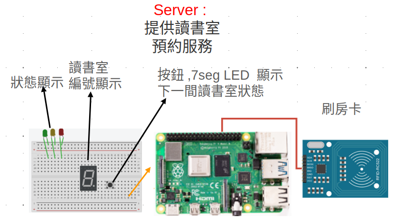
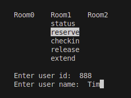

#### linux driver 期末專題: 讀書室預約系統   

- [youtube demo 影片](https://www.youtube.com/watch?v=XIC0q5kzs4s)

#### 系統說明
- 讀書室預約與使用管理系統：提供讀書室資訊(status)、預約(reserve)、報到(checkin)、釋放(release)、延長(extend)、到時提醒。
- 三色LED顯示讀書室使用狀態  (🟢=空閒, 🟡= 已預約 , 🔴=使用中）
- 房間數量共有 3 個
- 七段顯示器：顯示目前選取的讀書室號碼
- 按鈕: 按下按鈕可以切換目前顯示的讀書室號碼
- 刷房卡: 使用 RFID, 有三張房卡,  房卡感應後就會預約對應的房間   
- 預約規則   
  - 時段單位：30分鐘 （可調整）
  - 取用時限：預約後5分鐘內需報到；逾時自動取消並釋出
  - 延長規則：無人候補可延長1次
  - 釋放規則：提前釋放立即開放；逾時未釋放由系統自動釋放
  - 候補機制(FIFO linked list) : 所有讀書室有人使用時，一旦有讀書室釋出將依序通知分配給隊列中最早等待者之後讀書室開放後使用順序採(FIFO)

#### 硬體架構  



#### 細部設計  
- semaphore: 使用 mutex_lock避免多個thread (使用者)存取讀書室狀態的時候 race condition
- timer: 使用 timer worker thread 每隔10ms scan 每個房間的狀態, 確認是否自動 release 或是進入候補機制   
- 按鈕 interrupt 以及去抖機制   : 按鈕按下時倒通 vdd, 放開時斷路, 所以我們在driver 使用 TRIGGER_RISING 在電壓上升的時候觸發 IRQ, 並呼叫 button_isr function
- waiting queue: 使用 linked list 來處理讀書室的候補機制
- ncurse gui : 在 client 使用 ncurse gui 的下拉選單來發送 command 到 server



```c
//***  final_driver_ver/room_driver.c  的 button interrupt
//* ----btn irq---------
init_waitqueue_head(&btn_wq);
btn_irq = gpio_to_irq(GPIO_16);
if (btn_irq < 0) {pr_err("Failed to get IRQ for GPIO_16\n");
  goto r_gpio;
}
if (request_irq(btn_irq, button_isr, IRQF_TRIGGER_RISING, "gpio_button_irq",  NULL)) {
  pr_err("Failed to request IRQ\n");
  goto r_gpio;
}
```


```sh  
cd final_driver_ver
#* compile user code
make user 
./room_server
./room_client 


#* compile driver code
make 
```


- 詳細指令, 接線請看  final_driver_ver/readme.md  
