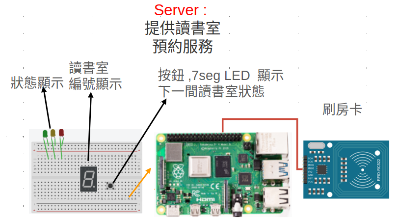
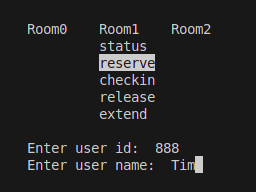

#### linux driver 期末專題: 讀書室預約系統   

- [youtube demo 影片](https://www.youtube.com/watch?v=XIC0q5kzs4s)

#### 系統說明
- 讀書室預約與使用管理系統：提供讀書室資訊(status)、預約(reserve)、報到(checkin)、釋放(release)、延長(extend)、到時提醒。
- 三色LED顯示讀書室使用狀態  (🟢=空閒, 🟡= 已預約 , 🔴=使用中）
- 房間數量共有 3 個
- 七段顯示器：顯示目前選取的讀書室號碼
- 按鈕: 按下按鈕可以切換目前顯示的讀書室號碼
- 刷房卡: 使用 RFID, 有三張房卡,  房卡感應後就會預約對應的房間   
- 預約規則   
  - 時段單位：30分鐘 （可調整）
  - 取用時限：預約後5分鐘內需報到；逾時自動取消並釋出
  - 延長規則：無人候補可延長1次
  - 釋放規則：提前釋放立即開放；逾時未釋放由系統自動釋放
  - 候補機制(FIFO linked list) : 所有讀書室有人使用時，一旦有讀書室釋出將依序通知分配給隊列中最早等待者之後讀書室開放後使用順序採(FIFO)

#### 硬體架構  



#### 細部設計  
- semaphore: 使用 mutex_lock避免多個thread (使用者)存取讀書室狀態的時候 race condition
- timer: 使用 timer worker thread 每隔10ms scan 每個房間的狀態, 確認是否自動 release 或是進入候補機制   
- 按鈕 interrupt 以及去抖機制   : 按鈕按下時倒通 vdd, 放開時斷路, 所以我們在driver 使用 TRIGGER_RISING 在電壓上升的時候觸發 IRQ, 並呼叫 button_isr function

```c
//***  final_driver_ver/room_driver.c  的 button interrupt
//* ----btn irq---------
init_waitqueue_head(&btn_wq);
btn_irq = gpio_to_irq(GPIO_16);
if (btn_irq < 0) {pr_err("Failed to get IRQ for GPIO_16\n");
  goto r_gpio;
}
if (request_irq(btn_irq, button_isr, IRQF_TRIGGER_RISING, "gpio_button_irq",  NULL)) {
  pr_err("Failed to request IRQ\n");
  goto r_gpio;
}
```
- waiting queue: 使用 linked list 來處理讀書室的候補機制
- ncurse gui : 在 client 使用 ncurse gui 的下拉選單來發送 command 到 server




#### how to run  

```sh  
cd final_driver_ver
#*  設定 linux_kernel 的路徑  
export LINUX_KERNEL_PATH=/home/elton/Desktop/emb_linux/linux  #這個是我自己的路徑  
make clean
#* compile driver code  
make   
#*  複製到 rpi  這個是我自己的 rpi 路徑  
scp -r ./final_driver_ver   elton@192.168.222.222:~/Desktop

ssh elton@192.168.222.222
pi$ cd ~/Desktop/final_driver_ver
pi$ sudo insmod room_driver.ko  
#    sudo rmmod room_driver.ko
pi$ lsmod | grep room_driver
pi$ dmesg |tail -n 10
#* compile user code
pi$ make user 
pi$ make ncurse 
pi$ make test_client
pi$ sudo su 
pi$ ./room_server
pi$ ./room_client 
pi$ python read_rfid.py

#* status
#* status  0    #只單純查看房間0 的狀態 led1 亮起 代表 free  
#* reserve 0 312513129
#* status  0    五秒內  可以看到 led 2 亮起 代表 reserved  
#* checkin 0    五秒內
#* status  0    可以看到 led 3 亮起
#* status 
```

### led pin  

```
                                  RPi gpio pin  
   gnd                      3.3 v---1  2    5v   
g f | a b                 GPIO  2   3  4    5v          
| | | | |                 GPIO  3   5  6 ---gnd         
 -------                  GPIO  4   7  8 ---GPIO 14 (led1)
|   a   |                     gnd   9  10---GPIO 15 (led2)
| f   b |             (a) GPIO 17---11 12---GPIO 18 (led3)
|   G   |             (b) GPIO 27---13 14---gnd          
| E   C |             (c) GPIO 22---15 16---gpio23      
|   D . |      (RFID:咖啡)   3.3v ---17 18---gpio24           
---------      (RFID?藍色)GPIO 10---19 20---gnd      (RFID-橘色)
| | | | |      (RFID?綠)  GPIO  9---21 22---gpio25  (RFID-RST?紅)   
e d | c Dp     (RFID?紫)  GPIO 11---23 24---gpio8   (RFID-SDA,灰)       
   gnd                        gnd   25 26---gpio7       
                      (d) GPIO  0---27 28---gpio1 
                      (e) GPIO  5---29 30---gnd 
                      (f) GPIO  6---31 32---gpio12
                      (g) GPIO 13   33 34---gnd
                          GPIO 19   35 36---GPIO 16 (button) 
                          GPIO 26---37 38---GPIO 20
                             gnd    39 40---GPIO 21 
```

```
RFID-RC522  
pin    0   1   2   3     4  5   6   7
      SDA SCK MOSI MISO RQ GND RST 3x3
      灰  紫   藍   綠   黃  橘  紅  咖啡
GPIO  8   11  10   9    X      25      
```

